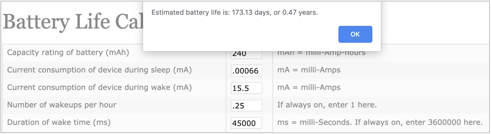
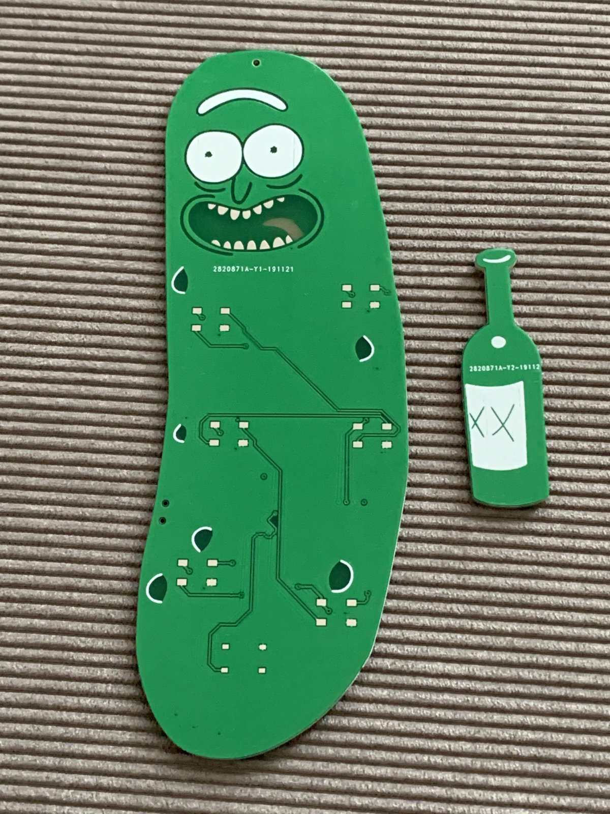
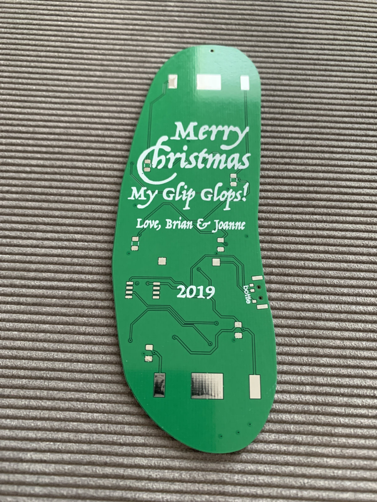
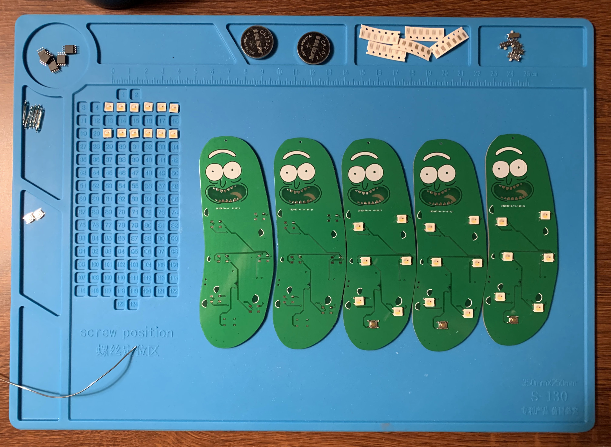
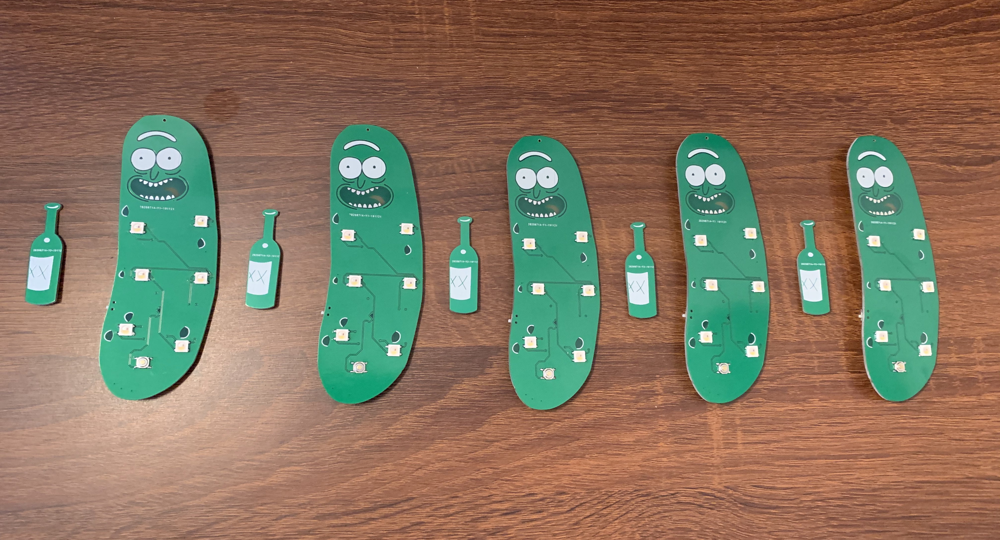
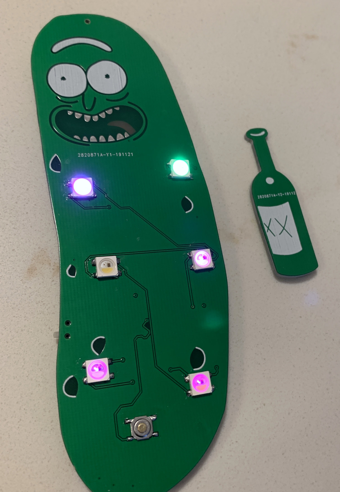

# XMAS Pickle Rick PCBs


Objectives
---
1. Make a christmas ornament PCB that twinkles.
   * [Inspiration (and code snippets)!](https://github.com/HybridAir/xmas_v4)
2. Use an ATTiny85 to drive SK6812 RGBW LEDs.
3. Make it battery powered.
4. Save as much energy as possible when not actively twinkling.
5. Don't just make a square PCB.

Batteries
---
To make the PCB portable, I chose to go with two CR2032 batteries, which are 3V each. I was worried about providing the ATTiny with too high of an input voltage, but with the drop across the LEDs and a Maximum Operating Voltage of 6.0V on the ATTiny85, I figured it was probably fine for this project.

Brains
---
I chose the ATTiny85 due to it’s low price, small size, and the fact that it's a computer the size of your thumbnail. It can easily fit the NeoPixel library, variables, and code with no issue. It also has some amazing low power sleep modes, which I’ll detail below. By running a normally open button from GND to RESET, I can have the NeoPixels do their twinkle ruotine, then shut them off and put the ATTiny85 to sleep to save power.

Problems with power
---
As a test of the lifespan of the batteries, I wanted to see how many days in a row I could click the reset button and see the lights before it was totally dead.  
##### Funny story— it lasted 1 day.
That’s because the SK6812 LEDs have an onboard IC that manages power. Even when the LEDs aren’t doing anything, they consume 1ma! With 6 LEDs in series, that added up to 6mAh **WASTED**, just sitting there on a desk doing nothing.
The two CR2032 batteries in series have a capacity of ~240 mAh. So that means that after 24 hours, the LEDs alone in a completely blank state, have consumed 65% of the available battery power.  I understand why this is necessary for most applications— so the chip can be awake and ready to receive instructions. But for portable projects, this will just never work well. And all this current consumption is without even factoring in the ATTiny so far.

Power savings
---
I read through the datasheet for the ATTiny, as well as the SK6812s. The ATTiny has some great sleep features, as well as the ability to shut down other features, such as the ADC, which I won't be using here.

```
#include <avr/sleep.h>
...
// disable ADC (before power-off)
#define adc_disable() (ADCSRA &= ~(1<<ADEN));
...
// Disable ADC, uses ~320uA passively
adc_disable();
...
// Specify power down sleep mode
set_sleep_mode(SLEEP_MODE_PWR_DOWN);
```

After a whole bunch of tweaking the code, I was able to get the following consumption:
* While running, cycling through different intensities and colors on the LEDs:
  * 3-28mA
* While sleeping:
  * 6-8mA

This seemed ok, but that passive loss of 6mA seemed like a complete non-starter for a battery operated gadget like this. To clean this up, I added a 2n7000 mosfet between the low side of the LEDs and the negative side of the power supply and coded in a shut off after the LEDs did their thing.

```
// Turn mosfet off to kill power to led chips
delay(20);
digitalWrite(gate, LOW);
```

Additionally, I set the data out pin for the LEDs to INPUT to set it to high impedence and stop any current flow from the board:

```
// Brings idle consumption of Neopixels to 0
pinMode(pin, INPUT);
```

By doing so, I was able to cut the power down immensely:
* While sleeping, LED ICs off completely:
  * 660 nA (**nano Amps!**)

I honestly could not believe my voltmeter when I read 00.66 on the uA setting. I was assuming the decimal was wrong, but I confirmed that this is indeed possible if you take advantage of the sleep benefits. With this in mind, if I just ran this board, never turned on the LEDs, and kept it in sleep mode, it would last for years. I gathered a lot of this power saving info, as well as the confidence of the results, from [this write-up](http://www.gammon.com.au/power) which amazingly was able to get consumption during sleep to ~100nA.  
That’s insane!

Power calculations
---
Now that I have the transistor in place, a solid sleep pattern, and a RESET button to kick the IC back to life, I should be able to get a good long run out of the batteries in this board, given that the user doesn’t play with it all the time.  

The LEDs generate a random color, then fade out. This makes the overall consumption spike up to about 28mA, then gradually fall to about 3mA. This repeats for about 45 seconds, then the LEDs go blank, the mosfet shuts power off to them, and the ATTiny85 goes to sleep. The most basic averaging of the usage during the ‘on’ period should say that (28+3)/2=15.5mA.
Using the [Oregon Embedded battery life calculator](https://oregonembedded.com/batterycalc.htm), I was able to get these results:  



* 240 mAh = Two CR2032 in series
* .00066 mA = 660 nA
* 15.5 mA = avg during 45s ‘on’ period
* .25 wakeups/h = About 6 clicks to ‘on’ mode per day
* 45000ms = 45 Second ‘on’ period
## 173 days!
This is unbelievable… and I don’t mean like, “wow, this is so great, it’s unbelievable!”. It’s more like “Hmm, no, I don’t believe this." Mostly because my first test board lasted about one day... Literally:


|Date, Time| Status|
| ------------- |:-------------|
|**7/27** 11:07pm|Brand new batteries|
|**7/27** 11:07pm|Run 1, sleep - works great|
|**7/28** 8:23pm|Run 2, sleep - works great|
|**7/29** 9:51pm|Run 3 failed - barely lit red for 6 blinks, died|
|**7/29** 9:52pm|Run 4 failed -  blinked once, died|
**7/29** 9:53pm|Run 5 failed - removed and reinserted battery, blinked 4 times, died|  

### WELL, there’s not much else to do but field test this new board.
The batteries will stay in and will not be removed until the test is done. The board will either be twinkling LEDs or sleeping. I’ll try to run it at least 6 times per day.  
✅ = Button pressed, works great.  
⚠️ = Button pressed, starting to display problems.  
❌ = Button pressed, almost not working anymore.  
☠️ ‍= Button pressed, nothing happens.  

## Here we go!
|Date, Time| Status|
| ------------- |:-------------|
**11/1** 7:00pm|Brand new batteries
**11/1** 7:00pm, 7:05, 7:09, 10:24|✅✅✅✅
**11/2-11/3**|ATTiny was on/sleeping, button not clicked
**11/4** 4:26pm, 7:13, 7:37, 9:15|✅✅✅✅
**11/5** 10:04am, 10:49, 2:51pm, 5:03, 5:04, 6:48, 6:48, 6:49|✅✅✅✅✅✅✅✅
**11/5** 9:31pm, 9:32, 9:33, 9:34, 9:35, 9:36, 9:38, 9:41, 9:43, 9:48|✅✅✅✅✅✅✅✅✅✅
**11/6** 7:20am, 10:18am, 6:16pm, 6:17, 6:18, 6:19, 6:23|✅✅✅✅✅✅✅
**11/7** 7:25am, 8:38am, 8:40am, 8:42, 8:52, 8:54, 9:06, 10:00, 10:02, 10:07, 10:34, 10:40|✅✅✅✅✅✅✅✅✅✅✅✅
**11/8** 9:55am, 9:58, 7:49pm, 7:50, 7:52. 7:53, 7:56, 8:00, 9:10, 9:12, 9:16|✅✅✅✅✅✅✅✅✅✅✅
**11/9** 9:21pm, 9:23|✅✅
**11/10** 4:16pm, 4:24, 5:43, 8:02, 9:54|✅✅✅✅✅
**11/11** 1:16am, 7:38am, 7:40, 5:28pm, 5:48|✅✅✅✅✅
**11/12** 2:30pm, 2:33, 2:40, 3:54, 3:57, 4:00, 4:50|✅✅✅✅✅✅✅ Matt was visiting, probably clicked it another 8 times and didn’t record it 😅
**11/14** 6:37am, 6:38, 5:55pm, 5:57, 10:20, 10:22, 11:22|✅✅✅✅✅✅✅
**11/15** 12:27am, 12:28, 12:52, 12:54, 6:56, 12:48pm, 12:49, 7:17|✅✅✅✅✅✅✅✅
**11/16** 9:01am|✅
**11/17** 8:40am, 8:41, 8:42, 9:09pm|✅✅✅✅
**11/18** 7:22am, 8:56, 9:40, 9:41, 3:48pm, 3:51, 3:55, 3:56, 3:58, 5:10, 6:01, 6:02, 10:18|✅✅✅✅✅✅✅✅✅✅✅✅✅
**11/19** 7:18, 7:58, 10:06, 10:07, 10:10, 10:23, 10:26, 10:35, 11:15, 11:17, 11:21, 11:35|✅✅✅✅✅✅✅✅✅✅✅✅
**11/20** 7:11am, 8:50, 9:00, 9:05, 3:05pm, 9:15|✅✅✅✅✅✅
**11/21-11/22**|✅✅✅✅
**11/23** 2:26am, 2:45, 2:47, 9:39, 9:40, 9:49|✅✅✅✅✅✅
**11/25** 12:38am, 12:39, 7:13, 7:14, 7:15|✅✅✅✅✅✅
**11/26** 8:10am|✅
**11/28** 🦃7:30am, 7:31, 7:32, 7:33, 9:25pm, 9:26, 9:32, 10:29, 10:31, 10:32|✅✅✅✅✅✅✅✅✅✅
**11/29** 1:36am, 2:19, 2:21, 2:30pm|✅✅✅✅

Ok, so this definitely worked. The prototype has been running for (at the time of writing this) just over two months, sleeping when not in use and flashing the LEDs when the button was pressed. So I’ll chalk this up as a success- no need to keep testing until the batteries are dead. Although I'm sure I'll want to confirm or deny that 173 day prediction.  

Unfortunately (**god f\*\*\*ing d\*\*\*it!**), while I was designing the Pickle Rick PCB, I was a bit too focused on the layout and design... I  forgot to add the transistor to the schematic and PCB layout. 🤦‍♂It wasn’t until I ordered the PCBs from China, had them rush shipped, and assembled six that I even realize I didn’t add the **ONE THING** that I thought was paramount to having a long lasting LED PCB.  

AND (**motherf\*\*\*er!**), instead of putting the batteries in series, I accidentally just followed the rat’s nest in KiCad and routed them in parallel. So instead of ~6v VCC, there’s about ~2.8v. I burned the bootloaders at 8MHz since the Neopixel library depends on it. And the datasheet says  that an ATTiny85 at 0 – 10 MHz can run between 2.7 - 5.5V. So… I’m a bit worried about lifespan and functional operation, but unfortunately there’s just not enough time to fix it and get a new order shipped to me before christmas. After a test of one of the boards, it last about a week...  

### Oh well… lesson learned. They still came out pretty killer in my opinion! 😊






